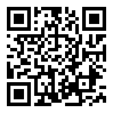

# Fast2D
Draw shapes and text using [Canvas Web API](https://developer.mozilla.org/en-US/docs/Web/API/Canvas_API) or [wgpu](https://wgpu.rs/)

Questions ▷ martin@kavik.cz

## Overview

Fast2D is a Rust library for efficient 2D graphics rendering in browsers and webviews via WebAssembly. It provides a simple API for drawing shapes and text.

## Features

- Draw rectangles, circles, lines, and text
    - More shapes and tools will likely be supported in the future as needed
- Multiple rendering backends: WebGL, WebGPU, Canvas API
- Easy font loading and registration
- Tested with [MoonZoon](https://github.com/MoonZoon/MoonZoon) and [Tauri](https://tauri.app/) in examples and in the [NovyWave](https://github.com/NovyWave/NovyWave) app
- [Lyon](https://github.com/nical/lyon) is used for tessellation (dividing shapes into triangles), [Glyphon](https://github.com/grovesNL/glyphon) for text rendering

## Tested Platforms (03-05-2025)

| OS          | Browser | WebGL | WebGPU | Canvas API |
|-------------|---------|:-----:|:------:|:----------:|
| **Windows** | Edge    |  ✅   |  ✅    |    ✅      |
|             | Chrome  |  ✅   |  ✅    |    ✅      |
|             | Firefox |  ✅   |  ❌    |    ✅      |
|             | Tauri   |  ✅   |  ✅    |    ✅      |
| **macOS**   | Safari  |  ✅   |  ❌    |    ✅      |
|             | Chrome  |  ✅   |  ✅    |    ✅      |
|             | Tauri   |  ✅   |  ❌    |    ✅      |
| **Linux**   | Chrome  |  ✅   |  ❌    |    ✅      |
|             | Firefox |  ✅   |  ❌    |    ✅      |
|             | Tauri   |  ✅   |  ❌    |    ✅      |


## Demo (WebGL)

[fast2d-demo.kavik.cz](https://fast2d-demo.kavik.cz/)



## Installation

Add Fast2D to your `Cargo.toml`:

```toml
fast2d = { git = "https://github.com/FastWaveViewer/Fast2D", features = ["webgl"] }
```
- Choose one of these features: `"webgl"`, `"webgpu"`, `"canvas"`.
- Add the `rev` attribute to select a specific commit.
- The library will be published to [crates.io](https://crates.io/) later.

## Usage Example

_Note:_ Code snippets inspired by [browser_example/frontend/src/main.rs](examples/browser_example/frontend/src/main.rs)

1. Fetch and register fonts

    ```rust
    let fonts = try_join_all([
        fast2d::fetch_file("/_api/public/fonts/Inter-Regular.ttf"),
        fast2d::fetch_file("/_api/public/fonts/Inter-Bold.ttf"),
    ]).await.unwrap_throw();

    fast2d::register_fonts(fonts).unwrap_throw();
    ```

2. Define objects to render
    ```rust
    let mut example_objects: Vec<fast2d::Object2d> = vec![
        fast2d::Rectangle::new()
            .position(50., 50.)
            .size(200., 150.)
            .color(50, 0, 100, 1.0)
            .into(),
        fast2d::Text::new()
            .text("Simple Rectangle")
            .position(10., 50.)
            .size(350., 120.)
            .color(255, 255, 255, 0.2)
            .font_size(60.)
            .family(fast2d::Family::name("Inter"))
            .into(),
    ];
    ```

3. Wrap your [HtmlCanvasElement](https://docs.rs/web-sys/latest/web_sys/struct.HtmlCanvasElement.html)

    ```rust
    let mut canvas_wrapper = fast2d::CanvasWrapper::new_with_canvas(canvas).await;
    ```

4. Draw defined objects

    ```rust
    canvas_wrapper.update_objects(move |objects| {
        mem::swap(objects, &mut example_objects)
    });
    ```

5. Notify `CanvasWrapper` on canvas size change

    ```rust
    canvas_wrapper.resized(width, height);
    ```
    _Note:_ Size change listener hasn't been implemented directly in this library (yet?), look at MoonZoon's [resize_observer.rs](https://github.com/MoonZoon/MoonZoon/blob/main/crates/zoon/src/resize_observer.rs) for inspiration.  

## Building & Running Examples

See the [browser_example](examples/browser_example/README.md) and [tauri_example](examples/tauri_example/README.md) for instructions.

## Wasm module size (browser_example)

| Compression |  WebGL  |  WebGPU  | Canvas API |
|-------------|--------:|---------:|-----------:|
| -           | 2903 KB |  1432 KB |     237 KB |
| Gzip        | 1100 KB |   576 KB |     106 KB |
| Brotli      |  847 KB |   445 KB |      88 KB |

## License

This project is licensed under the [MIT License](LICENSE).

## Funding

This project is funded through [NGI Zero Core](https://nlnet.nl/core), a fund established by [NLnet](https://nlnet.nl) with financial support from the European Commission's [Next Generation Internet](https://ngi.eu) program. Learn more at the [NLnet project page](https://nlnet.nl/project/NovyWave).

[](https://nlnet.nl)
[](https://nlnet.nl/core)
